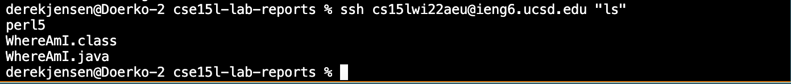

# Week 2 Lab Report 1
## *Derek Jensen* 
___
Here I'm going to tell you how to log into your course specific account using the following steps.
___
## Step 1:
**Installing VSCode**

* To download VSCode, simply navigate to 
[this](https://code.visualstudio.com/)
website
* Click on the large download button
* Navigate through the steps given by the installer to download VSCode
* Once that is done, try running VSCode, and you should end up with a window looking like this:


## Step 2:
**Remotely Connecting**

* Click on the Terminal tab in the file heading
* Click on New Terminal in order to open up a new terminal
* Assuming you have your course specific account and password, enter the command 
```
ssh cs15l<term><account-specific letters>@ieng6.ucsd.edu
```
* You should be prompted to enter the password to the course-specific account. Enter in your password when prompted
* This should successfully connect you remotely, giving you this terminal message:


## Step 3:
**Trying Some Commands**

Now that you're connected remotely, you can try inputting some commands. Here are some commands you can try:
>```cd```
>

>```cd ~```
>

>```ls```
>

>```ls -lat```
>

>```ls -a```
>

>```cp /home/linux/ieng6/cs15l<term>/public/hello.txt ~/```
>

>```cat /home/linux/ieng6/cs15l<term>/public/hello.txt```
>
Here's an example of running the command ```cd```:

## Step 4:
**Moving files with scp**

For this step you can use any file you want. However, in my case, I created a new file called ```WhereAmI.java``` using the following code
```
class WhereAmI {
  public static void main(String[] args) {
    System.out.println(System.getProperty("os.name"));
    System.out.println(System.getProperty("user.name"));
    System.out.println(System.getProperty("user.home"));
    System.out.println(System.getProperty("user.dir"));
  }
}
```
From here, run the following command:
>```scp <file-name.extension> cs15l<term><three-letters>@ieng6.ucsd.edu:~/```
>
Enter your password when prompted. Your file should be moved now. If you aren't logged in, log in and run ```ls``` to check to make sure that your file is in the library. You should see your file name as such:

## Step 5:
**Setting an SSH Key**

Setting up an SSH Key will allow you to access something remotely, without the need of a password. To do this, simply enter the command 
>```ssh-keygen```
>
From here, in the directory ```.ssh``` a public key ```id_rsa.pub``` was created. Log back into the server, and enter the command
>```mkdir .ssh```
>
Logout from the server, and in the terminal enter the command
>```scp /Users/<your computer user>/.ssh/id_rsa.pub cs15l<term>@ieng6.ucsd.edu:~/.ssh/authorized_keys```
>
From here, you should be able to log into the server without the use of a password, as well as use the ```scp``` command without use of the password, as such:

## Step 6:
**Optimizing Remote Running**

There are various tricks to get used to when remotely operating something. For example, you can run commands at the end of an ```ssh``` command, as such:

Similarly, you can separate commands on a single line with a semicolon.

Finally, you can use the up arrow to run the previous command.