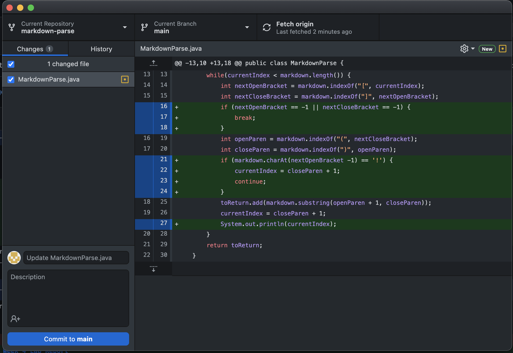
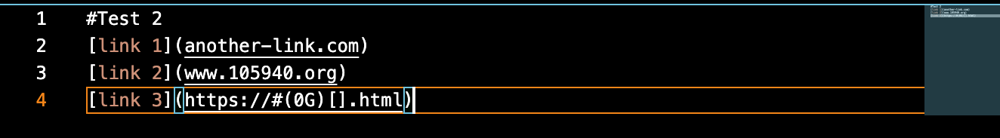
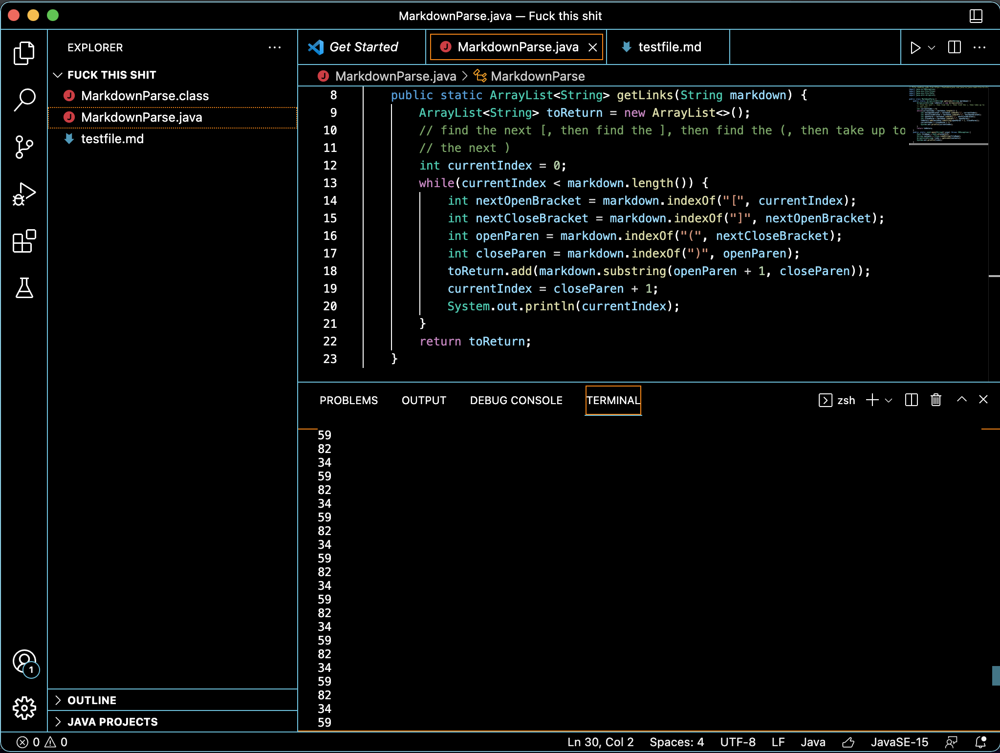

# Week 4 Lab Report 2
## *Derek Jensen*
___

This image shows all three code changes that were made to the code.

All these changes were made because when this [file](test-break.md) was run for testing, the program would enter an infinite loop. Seeing as the file link only takes you to another webpage filled with the links, this is what the file looked like:

To combat this, the print statement was put in in order to get a grasp of which indexes were looping infinitely. This resulted in this output:

