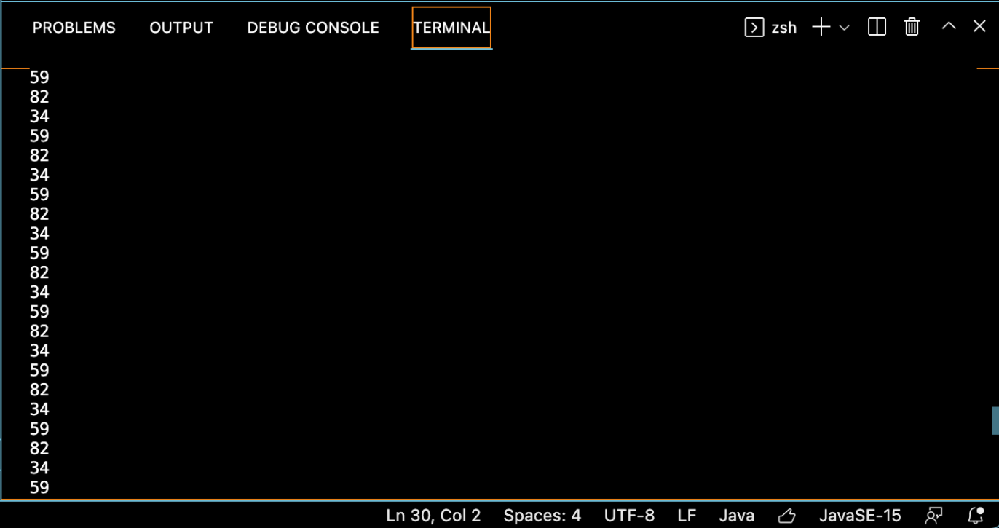

# Week 4 Lab Report 2
## *Derek Jensen*
___

This image shows all three code changes that were made to the code.

All these changes were made because when this [file](test-break.md) was run for testing, the program would enter an infinite loop. Seeing as the file link only takes you to another webpage filled with the links, this is what the file looked like:

Similarly, this test file gave us trouble due to its use of image links:

This test file gave another instance of an infinite loop.

To combat this, the print statement was put in in order to get a grasp of which indexes were looping infinitely. This resulted in this output:

From here, we were able to see that the reason it kept looping back to the beginning was because it would detect the parenthesis or the brackets later on embedded in the link (the bug), and thus would constantly loop (the symptom). In order to combat this, the break statement shown in the code changes was put in to make sure that it would work properly.

Similarly, in order to combat the instance of image links causing an infinite loop, the continue statement would come in to prevent the program from progressing into a loop.