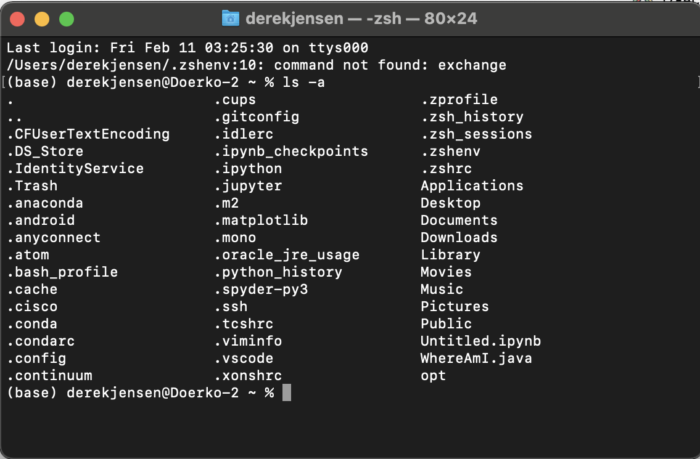

# Week 6 Lab Report 3
## *Derek Jensen*
___
## Streamlining ssh Configuration

To start with, we need to access the .ssh folder from the terminal. Go to the default starting directory, and using the command ```ls -a``` you can see that the .ssh folder is in the current directory.


Enter the .ssh folder using the command ```cd .ssh```.


To streamline our ssh configuration, we need to create a blank file called config. To do this, enter the command ```touch config```.


Open the config file using any text editor. In this case, I am opening with Mac OS's default text editor, Text Editor.


Here, enter in the command shown in the screenshot. This creates a host alias ieng6, linking it to the server ieng6.ucsd.edu set to my specific user login to the server.


Now that the alias ieng6 has been set using the command shown previously, now we can login using only ```ssh ieng6```


Now that the alias has been set, we can also copy files over using the new alias. Here, we will be copying the DemonstrateCopy.java file over to the remote server.


Now I can copy the file shown to the remote server using the alias alone. Thus, inputting the command ```scp DemonstrateCopy.java ieng6:~/``` will copy the file over to the remote server.


Now the file we just copied over to the server using only the new server alias created using the config file will show up when the command ```ls``` is run, as shown below.
