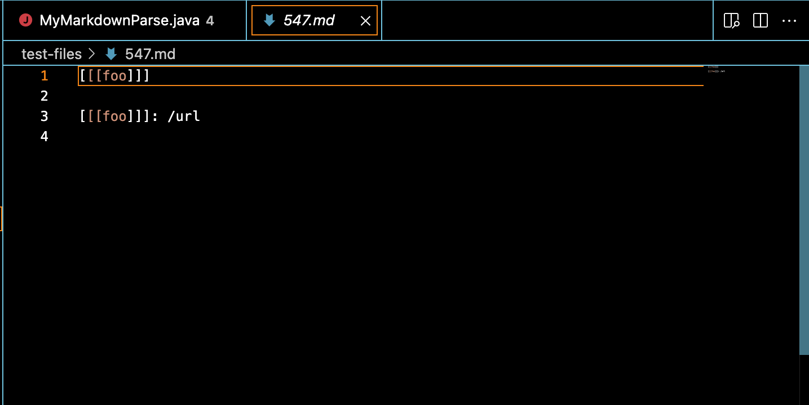
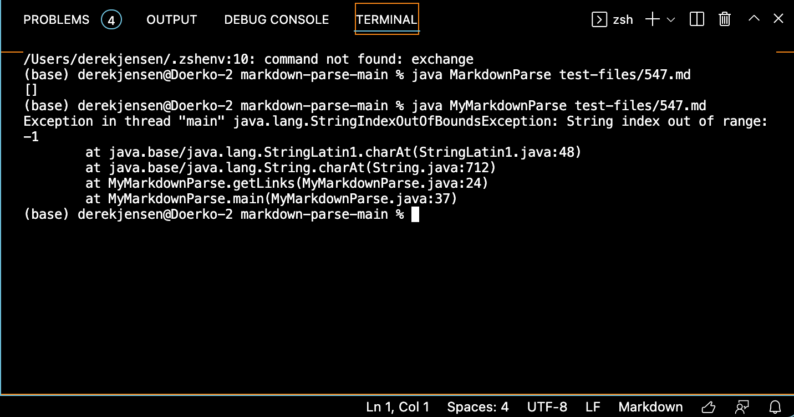

# Week 10 Lab Report 5
## *Derek Jensen*
___
For this lab report, to make things easier on myself, I have made my implementation for markdown-parse a java file named MyMarkdownParse.java, whereas the implementation provided in week 9 is simply named MarkdownParse.java.

To find the test cases in which the two different implementations would yield different results, I manually searched through the test files to see which ones would yield different results. To do this, knowing generally the issues that arose from my own implementation of markdown-parse, I looked through the test files to see which ones I thought would most likely yield different results, and then ran the two implementations for that test file. Through this method, I found two different results yielded for test files 547.md and 592.md.

Given test case 547:

We can see that the expected outcome of running this file through a markdown-parse would be empty brackets [].
The results of running the two implementations were as follows:

