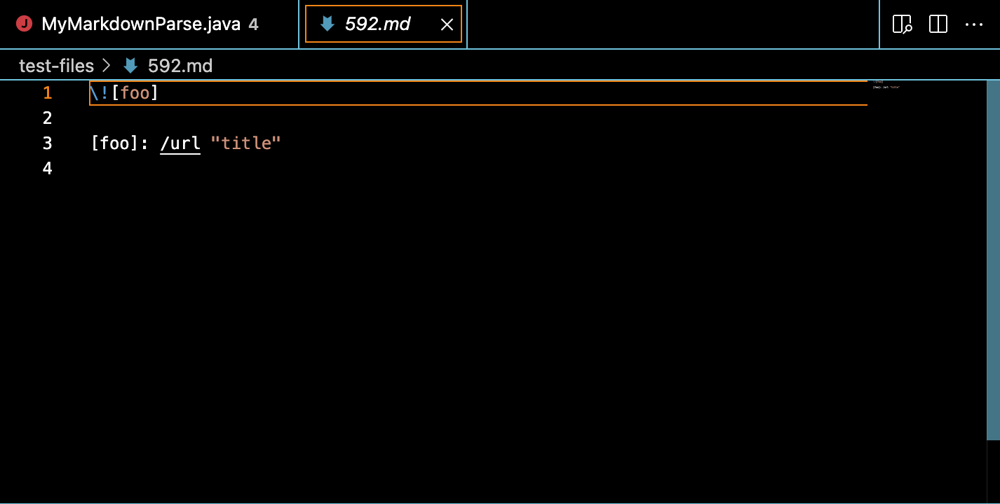
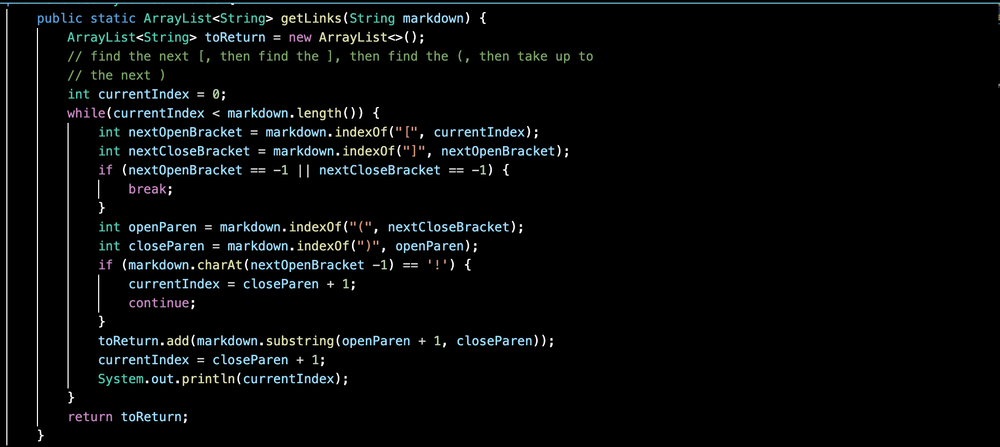

# Week 10 Lab Report 5
## *Derek Jensen*
___
For this lab report, to make things easier on myself, I have made my implementation for markdown-parse a java file named MyMarkdownParse.java, whereas the implementation provided in week 9 is simply named MarkdownParse.java. My implementation of the getLinks method will be shown in a screenshot at the bottom of this page.

To find the test cases in which the two different implementations would yield different results, I manually searched through the test files to see which ones would yield different results. To do this, knowing generally the issues that arose from my own implementation of markdown-parse, I looked through the test files to see which ones I thought would most likely yield different results, and then ran the two implementations for that test file. Through this method, I found two different results yielded for test files 547.md and 592.md.

Given test case 547:

We can see that the expected outcome of running this file through a markdown-parse would be empty brackets [].
The results of running the two implementations were as follows:

As can be seen from these results, the implementation provided was correct, as it yielded the correct expected output [], whereas my implementation yielded an index out of bounds error. 
This is due to the fact that in my implementation, it doesn't account for files in which there are no parenthesis. In the entire while loop, it never actually checks to see whether or not the next open or close parenthesis are at index -1, and as such, ```int openParen = markdown.indexOf("(", nextCloseBracket);``` will create an index of -1, which, when run through ```toReturn.add(markdown.substring(openParen + 1, closeParen));```, yields the index out of bounds error shown in the image.

Given test case 592:

We can see that the expected outcome of running this file through a markdown-parse would also be empty brackets [].
The results of running the two implementations were as follows:

As can be seen from these results, the implementation provided was once again the correct implementation, as it yielded the expected output [], whereas my implementation got stuck in an infinite loop.
This is due to the fact, once again, that there are no parenthesis. However, in this instance, there are also no nested brackets. In the previous example, the error was also due to the fact that my implementation didn't take into account a lack of parenthesis. However, the previous example got an index out of bounds error because of the nested brackets. In this instance, however, the same lines of code make it so that currentIndex will keep looping back to 0, as when ```currentIndex = closedParen + 1;``` is run, this will lead to currentIndex returning to index 0, keeping the while loop constantly running regardless of what the index was previously, leading to this infinite loop.

